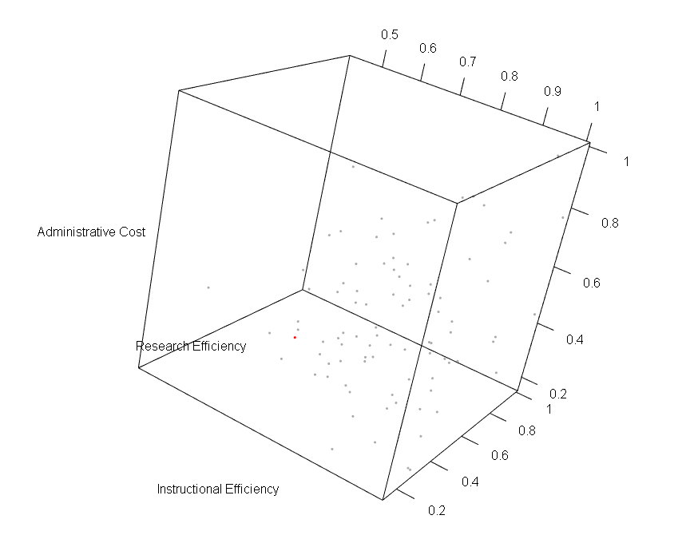

```{r setup, include=FALSE}
# knitr options
knitr::opts_chunk$set(fig.width = 8,
                      fig.asp = 0.618,
                      echo = TRUE)
knitr::knit_engines$set(python = reticulate::eng_python)

# include user functions
source(file="user-functions.R")

# Aaditional libraries
library(rDEA)
library(rgl)

set.seed(1965)

# constants and other presets

big_10 <- tribble(
  ~unitid, ~institution_name,
  153658, "University of Iowa",
  163286, "University of Maryland-College Park",
  170976, "University of Michigan-Ann Arbor",
  171100, "Michigan State University",
  174066, "University of Minnesota-Twin Cities",
  181464, "University of Nebraska-Lincoln",
  186380, "Rutgers University-New Brunswick",
  204796, "Ohio State University-Main Campus",
  214777, "Pennsylvania State University-Main Campus",
  240444, "University of Wisconsin-Madison",
  243780, "Purdue University-Main Campus",
  145637, "University of Illinois at Urbana-Champaign",
  151351, "Indiana University-Bloomington",
  147767, "Northwestern University"
)

regents <- tribble(
  ~unitid, ~institution_name,
  153603, "Iowa State University",
  153658, "University of Iowa",
  155317, "University of Kansas",
  174066, "University of Minnesota-Twin Cities",
  178396, "University of Missouri-Columbia",
  181464, "University of Nebraska-Lincoln",
  204796, "Ohio State University-Main Campus",
  243780, "Purdue University-Main Campus",
  126614, "University of Colorado Boulder",
  126818, "Colorado State University-Fort Collins",
  145637, "University of Illinois at Urbana-Champaign"
)

grab_frame <- function(vars, original) {
  select(original, vars)
}

run_dea <- function(input, output) {
  x <- dea(XREF=input,
           YREF=output,
           X=input,
           Y=output,
           model="output",
           RTS="Constant")
  
  # df$parameter <- names(x)
  
  return(x)
}

```

# Read Data

The following except was pulled by creating custom data files on the [IPEDS](https://nces.ed.gov/ipeds/use-the-data) data page at NCES.  (My kingdom for an API to call!)  These data are from 2016-17.

## IPEDS Finance

```{r read_finance}
keepers <- c("unitid",
             "Student Expenditures",
             "Administrative Expenditures",
             "Research Expenditures")

finance <- read_csv("data/finance.csv") %>%
  replace(., is.na(.), 0) %>%
  mutate(`Student Expenditures` = `F1617_F2.Instruction-Total amount` +
           `F1617_F1A.Instruction - Current year total` +
           `F1617_F2.Student service-Total amount` +
           `F1617_F1A.Student services - Current year total` +
           `F1617_F2.Net grant aid to students-Total amount` + 
           `F1617_F1A.Scholarships and fellowships expenses -- Current year total`,
         `Administrative Expenditures` = (`F1617_F2.Total expenses-Total amount` +
                                           `F1617_F1A.Total expenses and deductions - Current year total`) -
           (`F1617_F1A.Instruction - Current year total` + `F1617_F2.Instruction-Total amount` +
              `F1617_F1A.Research - Current year total` + `F1617_F2.Research-Total amount` +
              `F1617_F1A.Public service - Current year total` + `F1617_F2.Public service-Total amount` +
           `F1617_F1A.Hospital services - Current year total` + `F1617_F2.Hospital services-Total amount` +
           `F1617_F2.Net grant aid to students-Total amount` + 
           `F1617_F1A.Scholarships and fellowships expenses -- Current year total`),
         `Research Expenditures` = `F1617_F1A.Research - Current year total` + `F1617_F2.Research-Total amount`) %>%
  select(keepers)

```

## IPEDS Staff

```{r read_staff}
keepers <- c("unitid",
             "Faculty FTE",
             "Administrative FTE")

staff <- read_csv("data/staff.csv") %>%
  separate(`S2016_OC.Occupation and full- and part-time status`, c("time_status", "occupation"), sep = 9) %>%
  filter(occupation %in% c(" total", ", total", ", Instructional, research and public service", ", Librarians")) %>%
  mutate(occupation = recode(occupation,
                      " total" = "Total FTE",
                      ", total" = "Total FTE",
                      .default = "Faculty FTE"),
         fte = round(ifelse(time_status == "Full-time",
                      `S2016_OC.Grand total`,
                      `S2016_OC.Grand total` / 3), 2)) %>%
  group_by(unitid, occupation) %>%
  summarize(fte = sum(fte, na.rm = TRUE)) %>%
  ungroup() %>%
  spread(occupation, fte) %>%
  mutate(`Administrative FTE` = `Total FTE` - `Faculty FTE`) %>%
  select(keepers)

```

## IPEDS Enrollment

```{r read_enroll}
enroll <- read_csv("data/enrollment_2016.csv",
                   col_names = c("unitid",
                                 "inst",
                                 "yr",
                                 "Fall Enrollment",
                                 "Full-time Enrollment",
                                 "Part-time Enrollment",
                                 "Students-to-faculty"),
                   skip = 1) %>%
  mutate(`Estimated FTE` = `Full-time Enrollment` + `Part-time Enrollment` / 3) %>%
  select(-inst, -yr)

```

## IPEDS Degree Completions

```{r read_degrees}
degrees <- read_csv("data/completions.csv") %>%
  gather("field", "count", `DRVC2017.Associate's degree`:`DRVC2017.Doctor's degree - other`) %>%
  mutate(weight = recode(field,
                         `DRVC2017.Associate's degree` = 1,
                         `DRVC2017.Bachelor's degree` = 1,
                         `DRVC2017.Master's degree` = 1.5,
                         .default = 2),
         wge = count * weight) %>%
  group_by(unitid) %>%
  summarize(`Total Degree Awards` = sum(count),
            `Weighted Graduation Efficiency Score` = sum(wge))

```

## IPEDS Graduation Rates

```{r read_gr}
grad_rates <- read_csv("data/grad_rates.csv") %>%
  mutate(`Four-year Graduation Rate` = `DRVGR2016.Graduation rate - Bachelor degree within 4 years, total` / 100,
         `Five-year Graduation Rate` = `DRVGR2016.Graduation rate - Bachelor degree within 5 years, total` / 100,
         `Six-year Graduation Rate` = `DRVGR2016.Graduation rate - Bachelor degree within 6 years, total` / 100) %>%
  select(unitid, `Four-year Graduation Rate`, `Five-year Graduation Rate`, `Six-year Graduation Rate`)

```

## IPEDS 12-month Enrollment

```{r read_fye}
fye <- read_csv("data/fye.csv") %>%
  rename(`Total Enrollment` = `DRVEF122017.12-month unduplicated headcount, total: 2016-17`,
         `Student FTE` = `DRVEF122017.12-month full-time equivalent enrollment: 2016-17`) %>%
  select(unitid, `Total Enrollment`, `Student FTE`)

```

## NSF HERD

```{r read_nsf}
herd <- read_csv("data/nsf_herd.csv") %>%
  mutate(gov = federal_government + state_and_local_government,
         ext = total_rd_expenses - institutional_funds) %>%
  group_by(unitid) %>%
  summarize(`Government Grants` = sum(gov, na.rm = TRUE),
            `External Grants` = sum(ext, na.rm = TRUE),
            `Institutional Investment` = sum(institutional_funds, na.rm = TRUE))

```

## THE Scores

```{r read_the}
the_data <- read_csv("data/the_data2018.csv") %>%
  select(unitid = Unitid, `THE Citation Score` = Citations, `THE Research Score` = Research, `FTE Enrollment`)
```

## IPEDS Institutions

```{r read_ipeds}
institutions <- read_csv("data/ipeds_extract.csv",
                  col_names = c("unitid",
                                "Institution Name",
                                "Year",
                                "Carnegie Basic Class",
                                "State",
                                "Control",
                                "Land Grant Institution"),
                  skip = 1) %>%
  select(-Year) %>%
  inner_join(enroll, by = "unitid") %>%
  inner_join(fye, by = "unitid") %>%
  inner_join(degrees, by = "unitid") %>%
  inner_join(finance, by = "unitid") %>%
  inner_join(staff, by = "unitid") %>%
  inner_join(grad_rates, by = "unitid") %>%
  inner_join(herd, by = "unitid") %>%
  inner_join(the_data, by = "unitid") %>%
  filter(Control == "Public",
         `Carnegie Basic Class` %in% c("Doctoral Universities: Higher Research Activity",
                                       "Doctoral Universities: Highest Research Activity")) %>%
  mutate(`Weighted Graduation Efficiency Score` = `Weighted Graduation Efficiency Score` / `Total Enrollment`,
         `Student Expenditures per FTE` = `Student Expenditures` / `Student FTE`)

institutions
```

## Sniff Test

Were unitids assigned correctly in THE data?

```{r}
institutions %>%
  mutate(delta = `Student FTE` - `FTE Enrollment`,
         oddball = ifelse(abs(delta) > 10000, `Institution Name`, "")) %>%
  ggplot(aes(`Student FTE`, `FTE Enrollment`)) +
  geom_point() +
  geom_text(aes(label = oddball), hjust = 0, vjust = 0) +
  labs(title = "THE Compared to IPEDS FYE",
       subtitle = "Student FTE Estimates",
       x = "IPEDS",
       y = "THE")

```

# Models

Each model takes a vector of input variables and a vector of output variables.  It returns the efficiency estimates (theta) and a square matrix of weights (lambda) that can be used to etimate the areas of greatest inefficiency for the inefficient (< 1.0) units on each efficiency measure.

```{r}
models <- tribble(
  ~model, ~in.vars, ~out.vars,
  "Instruction",
  c("Student Expenditures per FTE",
    "Faculty FTE",
    "Students-to-faculty"),
  c("Weighted Graduation Efficiency Score",    # "Weighted Graduation Efficiency Score", "Six-year Graduation Rate"
    "Total Degree Awards"),      
  "Research",
  c("Faculty FTE",
    "Institutional Investment"),
  c("THE Research Score",
    "THE Citation Score",
    "External Grants"),
  "Administrative Cost",
  c("Administrative Expenditures",
    "Administrative FTE"),
  c("Total Degree Awards",
    "Student FTE")
)

dea_stat <- function(model) {
  # feasible
  # thetaOpt
  # lambda
  # lambda_sum
  
  df <- model %>%
    mutate(feasible = map(1),
           theta = map(2),
           lambda = map(3),
           lambda_sum = map(4))
  
  return(df)
}

# insts <- select(institutions, SchoolName_code)

models <- models %>%
  mutate(inputs = map(in.vars, grab_frame, original = institutions),
         outputs = map(out.vars, grab_frame, original = institutions),
         dea.model = map2(inputs, outputs, run_dea),
         feasible = map(dea.model, 1),
         theta = map(dea.model, 2),
         lambda = map(dea.model, 3),
         lambda_sum = map(dea.model, 4)) %>%
  select(-in.vars, -out.vars, -dea.model)

results <- institutions %>%
  select(unitid)

for (i in seq(1:3)) {
  results <- cbind(results, models$theta[[i]])
}

names(results) = c("unitid", models$model)

output <- institutions %>%
  mutate(UNL = ifelse(unitid == 181464,
                      1,
                      2),
         UNL = factor(UNL, levels = 1:2, labels = c("UNL", "Others")),
         colorby = ifelse(unitid == 181464,
                          "red",
                          "darkgrey")) %>%
  inner_join(results)

df <- output %>%
  select(unitid:Control, UNL, colorby, models$model)

df %>%
  select(unitid, `Institution Name`, Instruction, Research, `Administrative Cost`) %>%
  arrange(desc(Instruction), desc(Research), desc(`Administrative Cost`))
```

# Plot: Instruction By Administrative Cost Efficiency

```{r}
df %>%
  ggplot(aes(`Administrative Cost`, Instruction, color = UNL)) +
  geom_point(alpha = 3/5) +
  labs(title = "Instructional Efficiency by Administrative Cost Efficiency",
       y = "Instructional Efficiency",
       x = "Administrative Cost Efficiency") +
  theme(legend.position="none")
```

# Plot of All Three Measures

```{r}
# plot3d(x =df$Instruction,
#        y = df$Research,
#        z = df$`Administrative Cost`,
#        xlab = "Instructional Efficiency",
#        ylab = "Research Efficiency",
#        zlab = "Administrative Cost",
#        col = df$colorby)

```




